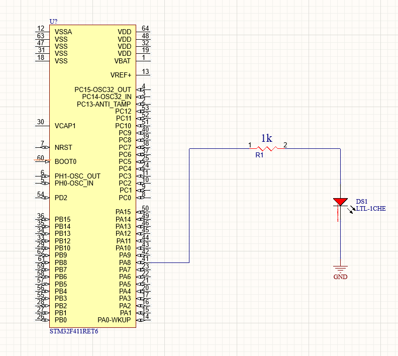

# Milestone 1 - Blinky Light

## Description

To start off with your kit project journey, we are going to make a light blink on your board. This will involve the creation of a hardware abstraction API. You can choose to make this API in either C or ARM assembly, depending on your preference.

## Wiring & Components

### Components

The diagram for this exercise doesn't involve soldering. The following pieces are necessary:

1. A Red LED (free @ EECS Tech Center)
2. Solderless breadboard (free @ EECS Tech Center)
3. A 1kΩ resistor (use a 220Ω if you're running into trouble) 
4. A wire kit (free @ EECS tech center)
5. An STM32F411 Nucleo Board (ESC part you will need to "check-out")

### Wiring Diagram

Keep in mind, you will need to connect your diode to Port A, Pin 8 (PA8). You can look at the datasheet for the STM32NucleoF411RE board to figure out which pin is connected to PA8. For ground, you can use the GND pin on your board.

## Turning a Pin On

In order to turn on our LED, we are going to need to write to various registers throughout the **MCU memory map**. More info on this can be found in the Embedded-Systems-101 repo.

### What goes into turning a pin "on"?

